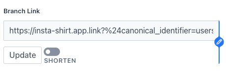
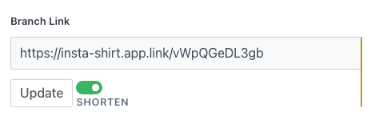
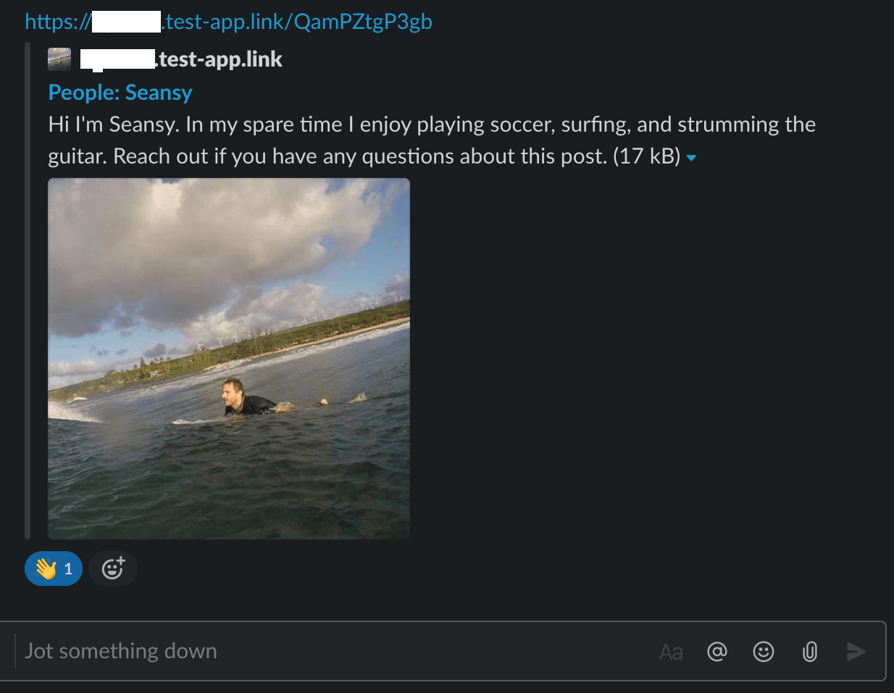
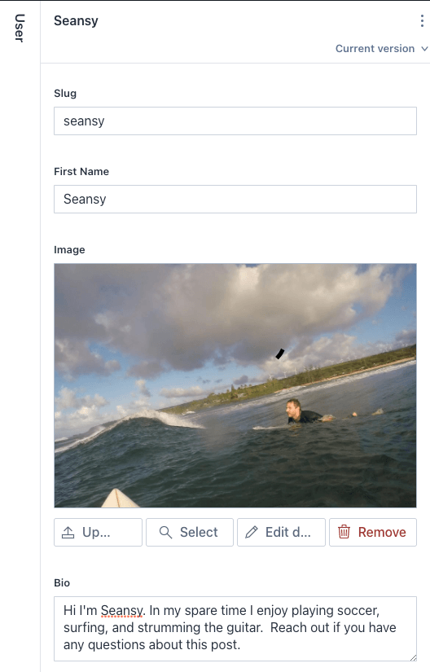
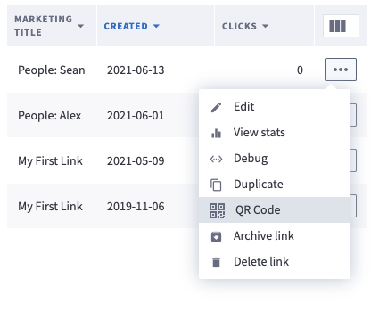

# sanity-plugin-branch-link

Connect [branch link attributes](https://help.branch.io/using-branch/docs/creating-a-deep-link#data-structure) directly to your sanity data model to faciliate link deep link navigation and link unfurling.

For help configuring read this [post](https://seansy.medium.com/universal-links-in-sanity-io-b0aaf33ce9b1)
## Installation

```bash
sanity install branch-link
```

# Configuration

For a schema with a `user` document, containing a `slug`, `firstName`, `image` and a `bio`, we could connect this data to branch.

```typescript
import BranchLink, { DeepLinkParams } from "sanity-plugin-branch-link";
import c from "part:@sanity/base/client";
const client = c.withConfig({ apiVersion: "2020-03-25" });
import sanityImageBuilder from "@sanity/image-url";
import { SanityDocument, Image, ImageAsset, Slug } from "@sanity/types";

const imageBuilder = sanityImageBuilder(client);

interface UserDocument extends SanityDocument {
  firstName: string;
  image: Image;
  slug: Slug;
  bio: string;
}
{
  type: "document",
  name: "user",
  title: "User",
  fields: [
    {
      type: "slug",
      name: "slug",
    },
    {
      name: "firstName",
      type: "string",
    },
    {
      name: "image",
      type: "image",
      options: {
        hotspot: true,
      },
    },
    {
      name: "bio",
      type: "text",
    },
    {
      name: "branchLink",
      title: "Branch Link",
      type: "url",
      inputComponent: BranchLink,
      options: {
        branchKey: "<your_branch_key>",
        baseUrl: "https://insta-shirt.app.link", //Base universal link url needed to generate long links

        /*
          These parameters will generate your branch link.
          1. For og_image_url images, be sure to properly format your image into a square for best results. In the case here, we use the hotspot to build a square image
          2. For deep links, you can generate $deeplink_path, $android_deeplink_path, $ios_deeplink_path, $desktop_url..etc using your sanity data, to properly route users to the correct destination based on their platform and whether they have the app.
          3. If you want to have data show

          For a complete list of parameters, reference
          https://help.branch.io/using-branch/docs/creating-a-deep-link#create-deep-links
        */
        getLinkParams: async (
          document: UserDocument
        ): Promise<DeepLinkParams> => {
          const results: { image: { asset: ImageAsset } }[] =
            await client.fetch(`*[_id=="${document._id}"]{
            image {
              ...,
              asset->{...}
            }
          }`);

          const { image } = results[0];
          const imageUrl = imageBuilder
            .image(image)
            .width(400)
            .height(400)
            .url();

          //Remove drafts in case this is a draft document:
          const publishedID = document._id.replace("drafts.", "");
          const pageTitle =  `People: ${document.firstName}`;
          const data: DeepLinkParams["data"] = {
            $canonical_identifier: `users/${publishedID}`,
            $deeplink_path: `users/${document.slug?.current}`,
            $desktop_url: `https://example.com/users/${document.slug?.current}`,
            $og_image_url: imageUrl,
            $og_title: pageTitle,
            $og_description: document.bio,
            $marketing_title: pageTitle,
          };
          return {
            data,
            // type: 2, // This will make the link show up in the dashboard for branch, and allow you to generate a QR code if you access from the branch dashboard
          };
      },
    }
  ]
}
```

## Screenshots

`BranchLink` represents it like:

<p>


</p>
### Unfurling
For the example above, if I generated that branch link and pasted it into slack, it would unfurl like...
<p>
  
  
</p>

## FAQ

> How can I get a QR code?

Branch's QR code API is only available to [enterprise level customers](https://help.branch.io/developers-hub/docs/qr-code-api). If you would like to add this for inline image support in sanity, submit a PR!

In the meantime, if you return `type: 2` in the `getLinkParams` function, it will generate an editable marketing link which has a QR code attached to it on the dashboard. From there you can access a QR code for that link if needed.


